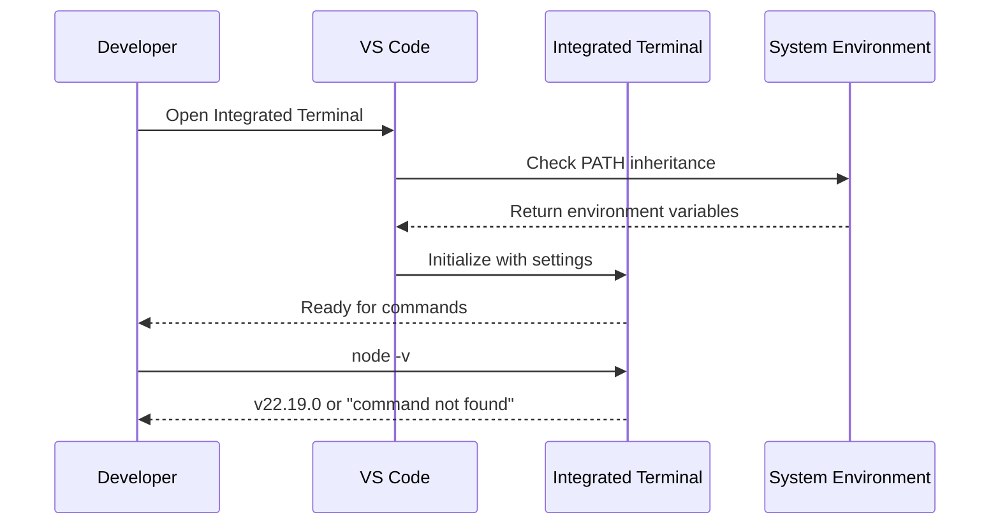
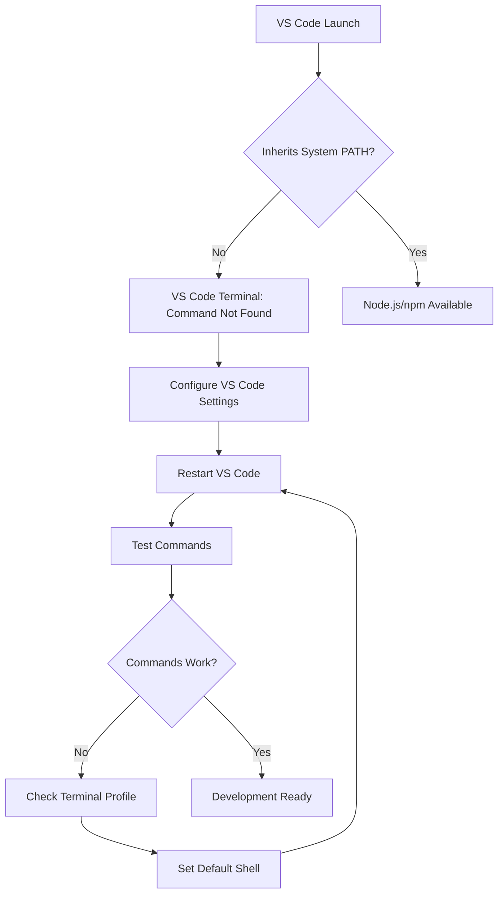
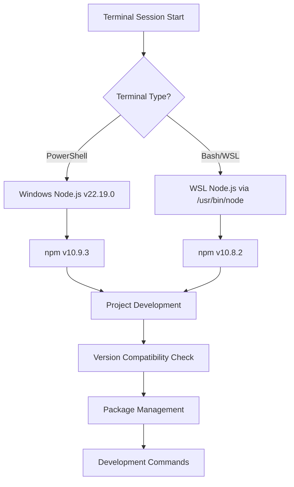
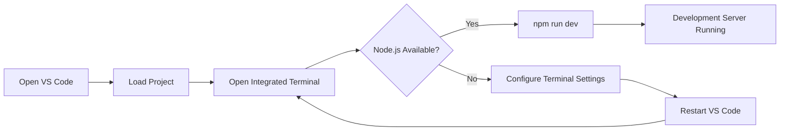
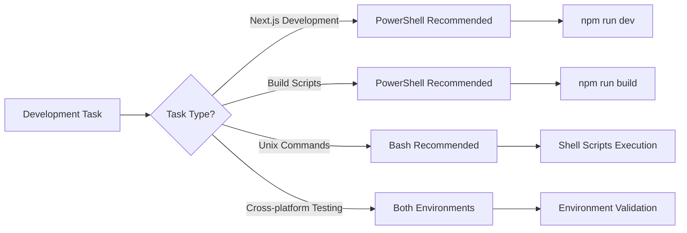
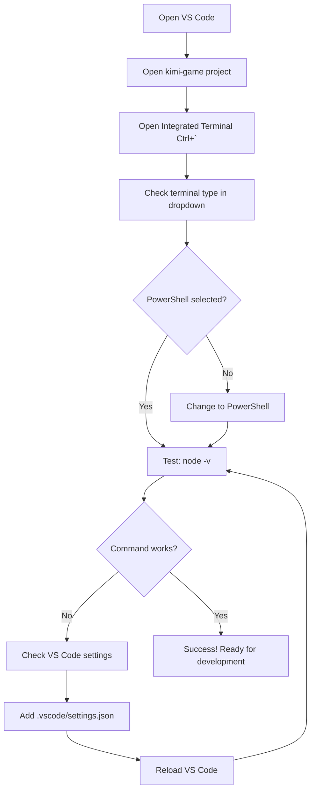
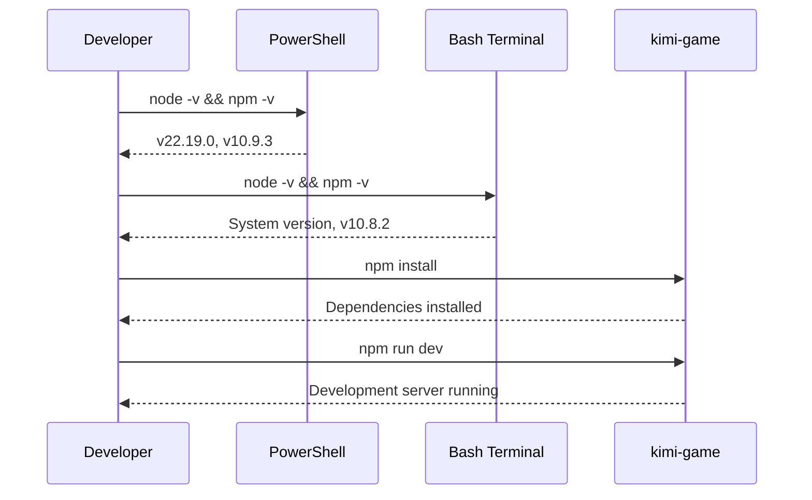

# VS Code Integrated Terminal Node.js Environment Setup

## Overview

Design for resolving VS Code integrated terminal Node.js/npm access issues and establishing a consistent development environment. While Node.js v22.19.0 and npm work in system terminals (PowerShell and bash), VS Code's integrated terminal requires specific configuration to inherit the correct PATH and environment variables.

## VS Code Terminal Configuration

### 1. VS Code Settings Configuration

#### Method 1: Workspace Settings (Recommended)
```json
// .vscode/settings.json
{
  "terminal.integrated.defaultProfile.windows": "PowerShell",
  "terminal.integrated.profiles.windows": {
    "PowerShell": {
      "source": "PowerShell",
      "icon": "terminal-powershell",
      "args": ["-NoLogo"]
    },
    "Git Bash": {
      "path": "C:\\Program Files\\Git\\bin\\bash.exe",
      "icon": "terminal-bash"
    }
  },
  "terminal.integrated.inheritEnv": true,
  "terminal.integrated.env.windows": {
    "PATH": "${env:PATH};C:\\Program Files\\nodejs"
  }
}
```

#### Method 2: Global VS Code Settings
```json
// User Settings (Ctrl+Shift+P -> "Preferences: Open Settings (JSON)")
{
  "terminal.integrated.defaultProfile.windows": "PowerShell",
  "terminal.integrated.inheritEnv": true,
  "terminal.integrated.env.windows": {
    "PATH": "${env:PATH};C:\\Program Files\\nodejs"
  }
}
```

### 2. Terminal Profile Selection



#### PowerShell Profile Setup
```powershell
# Check current PowerShell profile
$PROFILE

# Create profile if it doesn't exist
if (!(Test-Path -Path $PROFILE)) {
    New-Item -ItemType File -Path $PROFILE -Force
}

# Add Node.js to PATH in profile
Add-Content -Path $PROFILE -Value '$env:PATH += ";C:\Program Files\nodejs"'
```

#### Git Bash Profile Setup
```bash
# Add to ~/.bashrc or ~/.bash_profile
echo 'export PATH="/c/Program Files/nodejs:$PATH"' >> ~/.bashrc
source ~/.bashrc
```

## Architecture

### VS Code Terminal Environment Issues



#### Problem Analysis
- **System Terminal**: Node.js v22.19.0, npm v10.9.3 ✅
- **VS Code Terminal**: Commands not recognized ❌
- **Root Cause**: VS Code not inheriting system PATH or using wrong shell profile

### Environment Detection and Management



### Dual Environment Configuration

#### 1. PowerShell Environment
- **Node.js**: v22.19.0 (Windows installation)
- **npm**: v10.9.3
- **Location**: `C:\Program Files\nodejs`
- **Execution Policy**: Resolved via Git installation

#### 2. Bash/WSL Environment  
- **Node.js**: Available at `/usr/bin/node`
- **npm**: v10.8.2
- **Package Management**: Uses WSL-native Node.js installation

### VS Code Integration Workflow



#### Quick Fix Steps
1. **Immediate Solution**:
   ```
   Ctrl+Shift+P → "Terminal: Select Default Profile"
   Choose "PowerShell" or "Git Bash"
   ```

2. **Environment Variable Check**:
   ```powershell
   # In VS Code terminal
   $env:PATH
   # Should include: C:\Program Files\nodejs
   ```

3. **Force Refresh**:
   ```
   Ctrl+Shift+P → "Developer: Reload Window"
   ```

### Development Workflow Architecture

#### 1. Terminal Selection Strategy


#### 2. Project Commands Mapping

#### VS Code Terminal Commands
```powershell
# In VS Code integrated terminal
cd C:\www\kimi-game
node -v          # Should show: v22.19.0
npm -v           # Should show: 10.9.3
npm install      # Install dependencies
npm run dev      # Start development server
```

**PowerShell Commands**:
```powershell
# Navigate to project
cd C:\www\kimi-game

# Development server
npm run dev

# Build production
npm run build

# Dependency management
npm install
npm update
```

**Bash Commands**:
```bash
# Navigate to project (WSL path)
cd /mnt/c/www/kimi-game

# Development server
npm run dev

# Shell script execution
./start-server.sh

# Cross-platform compatibility testing
bash start-server.sh
```

## VS Code Troubleshooting

### 1. Common Issues and Solutions

#### Issue: "node is not recognized as an internal or external command"
**Solutions**:
1. **Check Terminal Profile**:
   ```
   Ctrl+` (open terminal) → Click dropdown arrow → Select "PowerShell"
   ```

2. **Verify VS Code Settings**:
   ```json
   // Check .vscode/settings.json exists with correct configuration
   {
     "terminal.integrated.defaultProfile.windows": "PowerShell",
     "terminal.integrated.inheritEnv": true
   }
   ```

3. **Manual PATH Addition**:
   ```powershell
   # In VS Code terminal
   $env:PATH += ";C:\Program Files\nodejs"
   node -v  # Test immediately
   ```

#### Issue: VS Code Uses Wrong Terminal
**Solutions**:
1. **Set Default Profile**:
   ```
   Ctrl+Shift+P → "Terminal: Select Default Profile" → Choose "PowerShell"
   ```

2. **Create New Terminal**:
   ```
   Ctrl+Shift+` (new terminal with correct profile)
   ```

#### Issue: Settings Not Applied
**Solutions**:
1. **Reload Window**:
   ```
   Ctrl+Shift+P → "Developer: Reload Window"
   ```

2. **Restart VS Code Completely**:
   ```
   Close VS Code → Reopen → Test terminal
   ```

### 2. Verification Steps



### 3. Workspace Configuration

#### Create .vscode/settings.json
```bash
# Create VS Code workspace settings
mkdir .vscode
echo '{
  "terminal.integrated.defaultProfile.windows": "PowerShell",
  "terminal.integrated.inheritEnv": true,
  "terminal.integrated.env.windows": {
    "PATH": "${env:PATH};C:\\\\Program Files\\\\nodejs"
  }
}' > .vscode/settings.json
```

## Environment Standardization

### 1. Version Compatibility Matrix

| Environment | Node.js | npm | Compatibility |
|-------------|---------|-----|---------------|
| PowerShell | v22.19.0 | v10.9.3 | ✅ Next.js 14.0.0 |
| Bash/WSL | System | v10.8.2 | ✅ Compatible |
| Requirement | v18+ | v9+ | ✅ Met |

### 2. Development Environment Validation



### 3. Environment-Specific Optimizations

#### PowerShell Optimizations
- **Execution Policy**: Resolved (scripts can run)
- **Path Resolution**: Native Windows paths
- **Performance**: Direct Node.js access
- **Recommended For**: Primary development workflow

#### Bash Optimizations  
- **Unix Compatibility**: Better for shell scripts
- **Path Convention**: WSL-style paths (`/mnt/c/`)
- **Cross-platform**: Linux-style command execution
- **Recommended For**: Shell script testing, Unix command compatibility

## Development Workflow Integration

### 1. Project Setup Validation
```bash
# Environment check script
echo "PowerShell Environment:"
powershell "node -v; npm -v"

echo "Bash Environment:"
bash -c "node -v; npm -v"

echo "Project Dependencies:"
npm list --depth=0
```

### 2. Development Server Management

#### Start Development Server
```powershell
# PowerShell (Recommended)
cd C:\www\kimi-game
npm run dev
# Serves at http://localhost:3000
```

```bash
# Bash Alternative
cd /mnt/c/www/kimi-game
npm run dev
# Same server, different terminal
```

#### Production Build
```powershell
# Build and start production server
npm run build
npm run start
```

### 3. Package Management Strategy

#### Dependency Installation
- **Primary**: Use PowerShell for faster performance
- **Backup**: Bash for troubleshooting
- **Validation**: Test in both environments

#### Version Management
- **Lock Files**: Ensure `package-lock.json` consistency
- **Environment Variables**: Configure for both terminals
- **Path Resolution**: Handle Windows vs Unix paths

## Testing Strategy

### 1. Cross-Environment Validation
```powershell
# PowerShell validation
npm test
npm run lint
npm run build
```

```bash
# Bash validation  
npm test
npm run lint
./start-server.sh
```

### 2. Environment-Specific Testing

#### PowerShell Testing
- Next.js development server functionality
- Build process validation
- Windows path resolution
- npm script execution

#### Bash Testing
- Shell script compatibility
- Unix command integration
- Cross-platform build verification
- WSL path handling

## Performance Considerations

### 1. Environment Selection Guidelines
- **Primary Development**: PowerShell (better Windows integration)
- **Shell Scripts**: Bash (Unix compatibility)
- **Build Processes**: PowerShell (faster execution)
- **Cross-platform Testing**: Both environments

### 2. Optimization Strategies
- Cache npm dependencies across environments
- Use consistent Node.js versions where possible
- Leverage environment-specific strengths
- Minimize environment switching during development

## Security and Best Practices

### 1. Execution Policies
- PowerShell execution policy resolved
- Maintain secure script execution
- Validate script sources before execution

### 2. Environment Isolation
- Keep environment-specific configurations separate
- Use consistent package versions
- Document environment dependencies
- Test in both environments before deployment